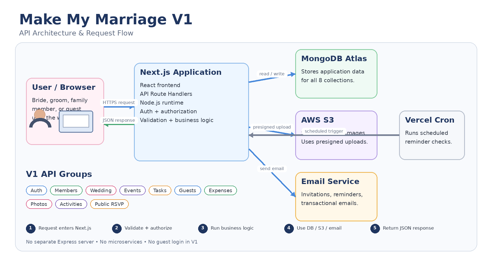

Make My Marriage

API Design Document - V1

| Version | 1.0 |
| --- | --- |
| Product | Make My Marriage |
| Initial Market | India |
| Primary Segment | Middle-class Indian weddings |
| Business Model | One-time payment per wedding |
| Platform | Responsive web application |
| Document Status | V1 API Design |

Figure 1. High-level API architecture and request flow for Make My Marriage V1

# 1. Document Purpose

Approved amendment (2026-10-05): [AUTHENTICATION_DECISIONS.md](AUTHENTICATION_DECISIONS.md) defines the current authentication requests, cookies, limits and atomic onboarding. Password recovery and invitation acceptance remain deferred.

This document defines the API design for Make My Marriage V1. It describes the REST-style API conventions, authentication and authorization rules, endpoint groups, request and response formats, validation rules, rate limiting, S3 upload flow, scheduled reminder integration, and the expected behavior of the Next.js Route Handlers that form the backend of the V1 modular monolith.

# 2. API Design Goals

- Keep the API simple enough for V1 while preserving clear module boundaries.

- Use predictable resource-oriented URLs and JSON request/response bodies.

- Keep all private wedding data scoped to the authenticated user's weddingId.

- Separate private authenticated APIs from public guest-facing APIs.

- Use role-based authorization for OWNER, ADMIN, and FAMILY_MEMBER.

- Support direct image uploads to AWS S3 through presigned URLs.

- Provide consistent validation, errors, rate limiting, and HTTP status codes.

- Avoid microservices and a separate Express/NestJS backend in V1.

# 3. API Architecture

The API is implemented inside the same Next.js application that serves the frontend. Next.js Route Handlers run on the Node.js runtime and perform validation, authentication, authorization, business logic, database access, S3 presigned URL generation, and email operations.

## 3.1 Request Flow

- The browser sends an HTTPS request to the Next.js application on Vercel.

- The matching Route Handler validates the request payload, path parameters, and query parameters.

- For protected APIs, the server resolves the authenticated user and verifies the user role and weddingId.

- Business logic runs and reads/writes data in MongoDB Atlas when required.

- Photo upload APIs generate AWS S3 presigned URLs rather than streaming large image files through the application server.

- Email operations call the configured transactional email provider.

- Vercel Cron invokes protected internal reminder logic for due tasks and upcoming events.

- The server returns a consistent JSON response to the browser.

# 4. API Standards and Conventions

| Standard | V1 Decision |
| --- | --- |
| Base path | /api/v1 |
| Transport | HTTPS only in production |
| Payload | JSON for normal API requests and responses |
| Naming | camelCase JSON fields; plural resource names |
| Identifiers | MongoDB ObjectId values represented as strings in JSON |
| Dates | ISO 8601 date/time values; server stores Date values in MongoDB |
| Authentication | Secure server-side authentication cookie; no guest login |
| Pagination | page + limit for list endpoints; default 20, maximum 100 |
| Filtering | Query parameters such as status, eventId, priority, assignedTo |
| Sorting | Default by most relevant field; allow selected sort options where useful |

## 4.1 Response Envelope

All normal JSON APIs should return a consistent structure.

{
  "success": true,
  "data": { ... },
  "message": "Operation completed successfully",
  "error": null
}

Errors use the same outer structure:

{
  "success": false,
  "data": null,
  "message": "Validation failed",
  "error": {
    "code": "VALIDATION_ERROR",
    "details": [ ... ]
  }
}

## 4.2 HTTP Status Codes

| Status | Meaning |
| --- | --- |
| 200 | Successful read/update |
| 201 | Resource created |
| 204 | Successful delete with no body |
| 400 | Malformed or invalid request |
| 401 | Not authenticated |
| 403 | Authenticated but not permitted |
| 404 | Resource not found |
| 409 | Conflict such as duplicate email/slug |
| 413 | Uploaded file exceeds allowed size |
| 429 | Rate limit exceeded |
| 500 | Unexpected server error |

# 5. Authentication and Authorization

OWNER, ADMIN, and FAMILY_MEMBER authenticate using email and password. Guests do not create accounts and only use public wedding endpoints. Because V1 is a same-origin Next.js application, the recommended approach is a secure HttpOnly authentication/session cookie rather than exposing authentication data to browser JavaScript. The exact authentication library is an implementation detail.

## 5.1 Roles

| Role | Private App | Manage Core Data | Special Rules |
| --- | --- | --- | --- |
| OWNER | Yes | Full | Can delete wedding and control ownership-level actions |
| ADMIN | Yes | Yes | Almost full management access |
| FAMILY_MEMBER | Yes | Limited | Can view finances, update assigned tasks, upload photos, and add activities |
| GUEST | No | No | Public site only; can RSVP and upload photos |

## 5.2 Core Authorization Rules

- Never trust weddingId supplied by the browser for private APIs. Resolve the wedding from the authenticated user whenever possible.

- OWNER and ADMIN can create, update, and delete events, guests, expenses, and most wedding settings.

- FAMILY_MEMBER can read allowed private information, update their assigned task status, upload photos, and add manual activities.

- Public APIs expose only the information required by the guest-facing wedding website.

- System-generated activities cannot be edited by normal users.

# 6. Authentication APIs

| Method | Endpoint | Access | Purpose | Notes |
| --- | --- | --- | --- | --- |
| POST | /api/v1/auth/register | Public | Create wedding and OWNER account atomically | Account + wedding details; creates initial 30-day session |
| POST | /api/v1/auth/login | Public | Authenticate user | Creates secure auth/session cookie |
| POST | /api/v1/auth/logout | Authenticated | End current session | Clears auth/session cookie |
| GET | /api/v1/auth/me | Authenticated | Get current user | Returns user role, relationshipType, weddingId |
| POST | /api/v1/auth/forgot-password | Public | Request password reset | Rate limited; generic response prevents email discovery |
| POST | /api/v1/auth/reset-password | Public | Reset password | Requires valid reset token |
| POST | /api/v1/auth/accept-invite | Public | Accept family/admin invitation | Signed invitation token + new password |

# 7. Wedding Member APIs

| Method | Endpoint | Access | Purpose | Notes |
| --- | --- | --- | --- | --- |
| GET | /api/v1/members | OWNER / ADMIN / FAMILY | List wedding members | Returns members for current wedding |
| POST | /api/v1/members/invite | OWNER / ADMIN | Invite member | Supports ADMIN or FAMILY_MEMBER relationship roles |
| GET | /api/v1/members/{memberId} | OWNER / ADMIN / FAMILY | Get member profile | Current wedding only |
| PUT | /api/v1/members/{memberId} | OWNER / ADMIN | Update member | Cannot transfer ownership in V1 |
| DELETE | /api/v1/members/{memberId} | OWNER / ADMIN | Remove member | Cannot remove OWNER through normal route |

# 8. Wedding and Dashboard APIs

| Method | Endpoint | Access | Purpose | Notes |
| --- | --- | --- | --- | --- |
| POST | /api/v1/weddings | Reserved | Separate workspace creation is deferred | Registration already creates the user's single wedding |
| GET | /api/v1/weddings/current | Authenticated | Get current wedding | One wedding per user in V1 |
| PUT | /api/v1/weddings/current | OWNER / ADMIN | Update wedding | Names, date, location, story, slug, cover image key |
| DELETE | /api/v1/weddings/current | OWNER | Delete wedding | Controlled hard-delete cascade |
| GET | /api/v1/dashboard | Authenticated | Get dashboard summary | Events, tasks, RSVP, budget, activities, recent photos |
| GET | /api/v1/budget | Authenticated | Get total budget and summary | FAMILY_MEMBER can view |
| PUT | /api/v1/budget | OWNER / ADMIN | Update total budget | Stored on wedding document |

# 9. Event APIs

| Method | Endpoint | Access | Purpose | Notes |
| --- | --- | --- | --- | --- |
| GET | /api/v1/events | Authenticated | List events | Sorted by startAt; current wedding only |
| POST | /api/v1/events | OWNER / ADMIN | Create event | startAt required; endAt optional |
| GET | /api/v1/events/{eventId} | Authenticated | Get event | Must belong to current wedding |
| PUT | /api/v1/events/{eventId} | OWNER / ADMIN | Update event | Includes venue and livestreamUrl |
| DELETE | /api/v1/events/{eventId} | OWNER / ADMIN | Delete event | Unsets eventId on related tasks, expenses, photos, activities |

# 10. Task APIs

| Method | Endpoint | Access | Purpose | Notes |
| --- | --- | --- | --- | --- |
| GET | /api/v1/tasks | Authenticated | List tasks | Filters: status, priority, eventId, assignedTo, dueFrom, dueTo |
| POST | /api/v1/tasks | OWNER / ADMIN | Create task | May optionally assign to a member and event |
| GET | /api/v1/tasks/{taskId} | Authenticated | Get task | Current wedding only |
| PUT | /api/v1/tasks/{taskId} | OWNER / ADMIN | Update task | Edit title, details, assignment, due date, priority |
| PATCH | /api/v1/tasks/{taskId}/status | Authenticated | Update task status | Assignee, OWNER, or ADMIN; FAMILY only for assigned task |
| DELETE | /api/v1/tasks/{taskId} | OWNER / ADMIN | Delete task | Hard delete |

# 11. Activity APIs

| Method | Endpoint | Access | Purpose | Notes |
| --- | --- | --- | --- | --- |
| GET | /api/v1/activities | Authenticated | List activities | Manual + system activities; newest first |
| POST | /api/v1/activities | OWNER / ADMIN / FAMILY | Create manual activity | Optional relatedEventId |
| GET | /api/v1/activities/{activityId} | Authenticated | Get activity | Current wedding only |
| PUT | /api/v1/activities/{activityId} | Creator / OWNER / ADMIN | Edit manual activity | SYSTEM activities are read-only |
| DELETE | /api/v1/activities/{activityId} | Creator / OWNER / ADMIN | Delete manual activity | SYSTEM activities cannot be deleted through normal route |

# 12. Guest Management APIs

| Method | Endpoint | Access | Purpose | Notes |
| --- | --- | --- | --- | --- |
| GET | /api/v1/guests | Authenticated | List guests | One record per individual person |
| POST | /api/v1/guests | OWNER / ADMIN | Create guest | name required; phone/email optional |
| GET | /api/v1/guests/{guestId} | Authenticated | Get guest | Current wedding only |
| PUT | /api/v1/guests/{guestId} | OWNER / ADMIN | Update guest | Can update contact and RSVP fields administratively |
| DELETE | /api/v1/guests/{guestId} | OWNER / ADMIN | Delete guest | Hard delete |

# 13. Expense APIs

| Method | Endpoint | Access | Purpose | Notes |
| --- | --- | --- | --- | --- |
| GET | /api/v1/expenses | Authenticated | List expenses | FAMILY_MEMBER can view |
| POST | /api/v1/expenses | OWNER / ADMIN | Create expense | eventId optional |
| GET | /api/v1/expenses/{expenseId} | Authenticated | Get expense | Current wedding only |
| PUT | /api/v1/expenses/{expenseId} | OWNER / ADMIN | Update expense | Includes payment status and paid amount |
| DELETE | /api/v1/expenses/{expenseId} | OWNER / ADMIN | Delete expense | Hard delete |
| GET | /api/v1/expenses/summary | Authenticated | Get expense summary | Totals by payment status/category/event |

# 14. Photo and S3 APIs

| Method | Endpoint | Access | Purpose | Notes |
| --- | --- | --- | --- | --- |
| GET | /api/v1/photos | Authenticated | List wedding photos | Optional eventId filter |
| POST | /api/v1/photos/presign | Authenticated | Create S3 presigned upload URL | Validates type, file size, and member permissions |
| POST | /api/v1/photos/complete | Authenticated | Save uploaded photo metadata | Called after successful S3 upload |
| DELETE | /api/v1/photos/{photoId} | OWNER / ADMIN or uploader | Delete photo | Delete S3 object + MongoDB metadata |

## 14.1 Direct Upload Flow

- Client requests a presigned URL with fileName, mimeType, fileSize, and optional eventId.

- Backend validates the request and creates a short-lived S3 presigned upload URL.

- Browser uploads the image directly to AWS S3.

- Client calls the complete endpoint with the returned s3Key.

- Backend inserts the photos metadata record in MongoDB.

# 15. Public Wedding and RSVP APIs

| Method | Endpoint | Access | Purpose | Notes |
| --- | --- | --- | --- | --- |
| GET | /api/v1/public/weddings/{slug} | Public | Get public wedding page data | Only guest-safe fields |
| GET | /api/v1/public/weddings/{slug}/events | Public | List public events | Includes venue and livestream when configured |
| GET | /api/v1/public/weddings/{slug}/photos | Public | List public gallery photos | No private metadata |
| POST | /api/v1/public/weddings/{slug}/rsvp | Public | Submit RSVP by guest name | Updates matching guest record; rate limited |
| POST | /api/v1/public/weddings/{slug}/photos/presign | Public | Presign guest photo upload | Requires uploadedByName; strict file/rate limits |
| POST | /api/v1/public/weddings/{slug}/photos/complete | Public | Save guest photo metadata | Stores uploadedByName + s3Key |

## 15.1 Public RSVP Request

POST /api/v1/public/weddings/sai-priya/rsvp
Content-Type: application/json

{
  "name": "Rahul Sharma",
  "rsvpStatus": "ATTENDING",
  "numberAttending": 1
}

## 15.2 Public RSVP Response

{
  "success": true,
  "data": {
    "name": "Rahul Sharma",
    "rsvpStatus": "ATTENDING",
    "numberAttending": 1
  },
  "message": "RSVP updated successfully",
  "error": null
}

# 16. Internal Cron API

Scheduled jobs should not be exposed as normal public APIs. Vercel Cron invokes an internal protected route or server function. The request must include a server-side secret or platform-supported authorization mechanism.

| Method | Endpoint | Access | Purpose | Notes |
| --- | --- | --- | --- | --- |
| POST | /api/v1/internal/cron/reminders | Vercel Cron only | Process due reminders | Checks due tasks/events and sends email reminders |

# 17. Request Validation Rules

- Validate all request bodies, query parameters, and path identifiers on the server.

- Reject invalid ObjectId values before database queries.

- Normalize email addresses before uniqueness checks.

- Validate enum values such as task status, task priority, RSVP status, payment status, role, and relationshipType.

- Ensure numberAttending is not negative and does not violate configured business rules.

- Ensure amount and paidAmount are valid numbers and paidAmount does not exceed amount unless explicitly allowed later.

- Validate startAt/endAt ordering for events and dueAt values for tasks.

- Validate image MIME type and maximum file size before issuing presigned URLs.

# 18. Pagination, Filtering, and Sorting

List APIs should use simple query parameters. V1 does not require cursor pagination.

GET /api/v1/tasks?page=1&limit=20&status=IN_PROGRESS&priority=HIGH&eventId=<id>
GET /api/v1/activities?page=1&limit=20
GET /api/v1/photos?page=1&limit=40&eventId=<id>

- Default page: 1.

- Default limit: 20 for most lists.

- Maximum limit: 100.

- Photo endpoints may use a larger default such as 40 if UI testing shows it is useful.

- Invalid filter values return 400 rather than being silently ignored.

# 19. Rate Limiting

Because the application runs on Vercel, V1 should use a durable rate-limiting strategy rather than an in-memory counter. MongoDB-backed counters are sufficient for the testing-stage V1 and can later be replaced by Redis or another dedicated service if needed.

- Login and password reset endpoints: strict limits per IP/email combination.

- Public RSVP endpoint: limit repeated submissions per IP and wedding slug.

- Public photo presign endpoint: strict limits to protect S3 usage.

- Authenticated photo presign endpoint: moderate user-based limits.

- Email-triggering endpoints: limits to prevent accidental or abusive email volume.

- Return HTTP 429 when a limit is exceeded.

# 20. Error Handling

APIs should never return raw stack traces or database errors to the browser. Internal logs should preserve technical details while client responses remain stable and understandable.

| Error Code | Example Use |
| --- | --- |
| VALIDATION_ERROR | Invalid request body or query parameter |
| UNAUTHENTICATED | No valid session |
| FORBIDDEN | Role does not allow action |
| NOT_FOUND | Requested resource does not exist |
| CONFLICT | Duplicate email or website slug |
| RATE_LIMITED | Too many requests |
| UPLOAD_ERROR | S3 upload setup/completion failed |
| INTERNAL_ERROR | Unexpected server failure |

# 21. Security Requirements

- Production traffic uses HTTPS.

- Authentication cookie is HttpOnly, Secure in production, and configured with an appropriate SameSite policy.

- Passwords are hashed before storage; plaintext passwords are never stored or logged.

- Every private database query is scoped to the authenticated user's wedding.

- Sensitive actions are authorized server-side; hiding buttons in the UI is not considered authorization.

- Public APIs expose only guest-safe fields.

- S3 presigned URLs are short-lived and generated only after validation.

- Cron/internal routes are protected with a secret and are never treated as public endpoints.

# 22. API Versioning

All V1 API routes use the /api/v1 prefix. Breaking changes should be introduced under a future /api/v2 prefix rather than silently changing existing V1 contracts. Backward-compatible additions, such as adding optional response fields, can remain within V1.

# 23. V1 API Implementation Order

- Authentication APIs

- Wedding creation/current wedding APIs

- Member invitation and management APIs

- Events APIs

- Tasks APIs

- Activities APIs

- Dashboard aggregation API

- Budget and expense APIs

- Guest management APIs

- Public wedding and RSVP APIs

- S3 photo upload APIs

- Email integration

- Cron reminder endpoint

- Rate limiting, security, and final validation

# 24. Explicitly Out of Scope for V1 APIs

- Payment gateway APIs

- WhatsApp, SMS, or mobile push notification APIs

- Vendor marketplace APIs

- Accommodation or transportation APIs

- AI assistant APIs

- Face-recognition/photo-search APIs

- Multi-wedding account switching APIs

- Planner/agency multi-tenant APIs

- Document or receipt upload APIs

- Separate microservice-to-microservice APIs

# 25. Final Summary

The Make My Marriage V1 API is designed as a clear REST-style contract inside the existing Next.js modular monolith. It separates authenticated wedding-management operations from public guest operations, uses role-based authorization, keeps every private resource wedding-scoped, and integrates MongoDB Atlas, AWS S3, email, and Vercel Cron without introducing unnecessary infrastructure. The result is an API surface that is straightforward to implement, test, document, and extend in future versions.
