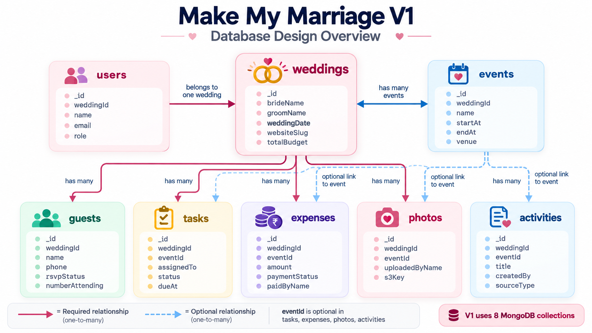

Make My Marriage

Database Design Document — V1

| Version | 1.0 |
| --- | --- |
| Product | Make My Marriage |
| Initial Market | India |
| Primary Segment | Middle-class Indian weddings |
| Business Model | One-time payment per wedding |
| Platform | Responsive web application |
| Document Status | V1 Database Design |

Figure 1. MongoDB collection overview and key relationships for Make My Marriage V1

# 1. Document Purpose

This document defines the database design for Make My Marriage V1. It explains the MongoDB collection structure, field design, relationships, indexes, enums, delete behavior, and the main data rules agreed for the first version of the product.

# 2. Database Design Principles

- Use MongoDB Atlas as the primary database.

- Keep the V1 schema simple and readable.

- Use eight core collections only.

- Use MongoDB ObjectId for internal identifiers.

- Store createdAt and updatedAt on important records.

- Store references such as weddingId, eventId, and createdBy using ObjectId values.

- Keep images in AWS S3 and store only metadata in MongoDB.

- Use hard deletes rather than soft deletes in V1.

# 3. Database Overview

V1 uses one MongoDB database with the following eight collections:

- users

- weddings

- events

- tasks

- guests

- expenses

- photos

- activities

# 4. Entity Relationship Summary

- A wedding is the root entity for the product workspace.

- Each authenticated user belongs to one wedding in V1.

- Each event belongs to one wedding.

- Each task belongs to one wedding and may optionally belong to one event.

- Each guest belongs to one wedding.

- Each expense belongs to one wedding and may optionally belong to one event.

- Each photo belongs to one wedding and may optionally belong to one event.

- Each activity belongs to one wedding and may optionally belong to one event.

# 5. Collection-by-Collection Design

## 5.1 users

Stores authenticated wedding members such as OWNER, ADMIN, and FAMILY_MEMBER.

| Field | Type | Required | Notes |
| --- | --- | --- | --- |
| _id | ObjectId | Yes | MongoDB primary key |
| weddingId | ObjectId | Yes | Reference to weddings._id |
| name | String | Yes | Display name |
| email | String | Yes | Must be unique |
| passwordHash | String | Yes | Never store plain password |
| role | Enum | Yes | OWNER, ADMIN, FAMILY_MEMBER |
| relationshipType | Enum | Yes | BRIDE, GROOM, BRIDE_MOTHER, etc. |
| createdAt | DateTime | Yes | Creation timestamp |
| updatedAt | DateTime | Yes | Last update timestamp |

Notes:

- relationshipType is a controlled field for close-family roles in V1.

## 5.2 weddings

Stores the main wedding workspace information.

| Field | Type | Required | Notes |
| --- | --- | --- | --- |
| _id | ObjectId | Yes | MongoDB primary key |
| brideName | String | Yes | Bride display name |
| groomName | String | Yes | Groom display name |
| weddingDate | DateTime | Yes | Primary wedding date |
| location | String | Yes | Primary wedding location |
| story | String | No | Couple story or introduction |
| websiteSlug | String | Yes | Used in /wedding/{slug}; unique |
| coverImageKey | String | No | S3 key for wedding cover image |
| totalBudget | Number | No | Overall wedding budget |
| createdBy | ObjectId | Yes | Reference to users._id |
| createdAt | DateTime | Yes | Creation timestamp |
| updatedAt | DateTime | Yes | Last update timestamp |

Notes:

- If a requested slug already exists, the application may generate a safe variation such as sai-priya-2.

## 5.3 events

Stores wedding ceremonies and event details.

| Field | Type | Required | Notes |
| --- | --- | --- | --- |
| _id | ObjectId | Yes | MongoDB primary key |
| weddingId | ObjectId | Yes | Reference to weddings._id |
| name | String | Yes | Example: Haldi, Sangeet, Wedding |
| description | String | No | Optional event details |
| startAt | DateTime | Yes | Event start date and time |
| endAt | DateTime | No | Event end date and time |
| venue | String | Yes | Venue name |
| location | String | No | Address or location text |
| livestreamUrl | String | No | External livestream URL |
| status | String | No | Optional status field |
| createdBy | ObjectId | Yes | Reference to users._id |
| createdAt | DateTime | Yes | Creation timestamp |
| updatedAt | DateTime | Yes | Last update timestamp |

## 5.4 tasks

Stores planning and coordination tasks.

| Field | Type | Required | Notes |
| --- | --- | --- | --- |
| _id | ObjectId | Yes | MongoDB primary key |
| weddingId | ObjectId | Yes | Reference to weddings._id |
| eventId | ObjectId | No | Optional reference to events._id |
| title | String | Yes | Task title |
| description | String | No | Optional task details |
| assignedTo | ObjectId | No | Reference to users._id |
| priority | Enum | Yes | LOW, MEDIUM, HIGH |
| status | Enum | Yes | TODO, IN_PROGRESS, COMPLETED |
| dueAt | DateTime | No | Due date and time |
| reminderSentAt | DateTime | No | Used for reminder control |
| createdBy | ObjectId | Yes | Reference to users._id |
| createdAt | DateTime | Yes | Creation timestamp |
| updatedAt | DateTime | Yes | Last update timestamp |

Notes:

- eventId is optional because some tasks are wedding-wide rather than event-specific.

## 5.5 guests

Stores individual guest records and RSVP data.

| Field | Type | Required | Notes |
| --- | --- | --- | --- |
| _id | ObjectId | Yes | MongoDB primary key |
| weddingId | ObjectId | Yes | Reference to weddings._id |
| name | String | Yes | Individual guest name |
| phone | String | No | Phone number |
| email | String | No | Email address |
| familyName | String | No | Family grouping label if needed |
| numberInvited | Number | No | How many were invited in context of this guest entry |
| numberAttending | Number | No | How many will attend |
| rsvpStatus | Enum | Yes | PENDING, ATTENDING, NOT_ATTENDING |
| rsvpUpdatedAt | DateTime | No | Last RSVP update timestamp |
| notes | String | No | Optional notes |
| createdAt | DateTime | Yes | Creation timestamp |
| updatedAt | DateTime | Yes | Last update timestamp |

Notes:

- V1 uses one record per individual guest.

## 5.6 expenses

Stores budget and expense entries.

| Field | Type | Required | Notes |
| --- | --- | --- | --- |
| _id | ObjectId | Yes | MongoDB primary key |
| weddingId | ObjectId | Yes | Reference to weddings._id |
| eventId | ObjectId | No | Optional reference to events._id |
| name | String | Yes | Expense item name |
| category | String | Yes | Expense category |
| amount | Number | Yes | Total expense amount |
| paidAmount | Number | No | Amount paid so far |
| paymentStatus | Enum | Yes | UNPAID, PARTIALLY_PAID, PAID |
| paidByUserId | ObjectId | No | Reference to users._id when applicable |
| paidByName | String | No | Useful when payer is not a registered user |
| notes | String | No | Optional notes |
| createdBy | ObjectId | Yes | Reference to users._id |
| createdAt | DateTime | Yes | Creation timestamp |
| updatedAt | DateTime | Yes | Last update timestamp |

Notes:

- Only OWNER and ADMIN manage expenses, while family members can view them in V1.

## 5.7 photos

Stores photo metadata for images saved in AWS S3.

| Field | Type | Required | Notes |
| --- | --- | --- | --- |
| _id | ObjectId | Yes | MongoDB primary key |
| weddingId | ObjectId | Yes | Reference to weddings._id |
| eventId | ObjectId | No | Optional reference to events._id |
| uploadedByUserId | ObjectId | No | Reference to users._id for logged-in uploads |
| uploadedByName | String | No | Guest or display name |
| s3Key | String | Yes | Path/key of object in S3 |
| fileName | String | Yes | Original file name |
| fileSize | Number | Yes | File size in bytes |
| mimeType | String | Yes | Example: image/jpeg |
| createdAt | DateTime | Yes | Upload timestamp |

Notes:

- V1 stores only metadata in MongoDB; image binaries remain in S3.

## 5.8 activities

Stores manual and system-generated wedding activity updates.

| Field | Type | Required | Notes |
| --- | --- | --- | --- |
| _id | ObjectId | Yes | MongoDB primary key |
| weddingId | ObjectId | Yes | Reference to weddings._id |
| title | String | Yes | Activity title |
| description | String | No | Activity detail |
| createdBy | ObjectId | Yes | Reference to users._id |
| relatedEventId | ObjectId | No | Optional reference to events._id |
| sourceType | Enum | Yes | MANUAL or SYSTEM |
| activityType | String | No | Optional category of activity |
| createdAt | DateTime | Yes | Creation timestamp |

Notes:

- OWNER, ADMIN, and FAMILY_MEMBER can manually add activities.

# 6. Index Design

| Collection | Index | Purpose |
| --- | --- | --- |
| users | email (unique) | Prevent duplicate member accounts and speed up login lookup |
| weddings | websiteSlug (unique) | Fast public wedding website lookup |
| events | weddingId | Fetch all events for a wedding |
| tasks | weddingId | Fetch all tasks for a wedding |
| tasks | assignedTo | Fetch My Tasks for a user |
| tasks | dueAt | Support due-date and reminder queries |
| guests | weddingId | Fetch guest list and RSVP stats |
| expenses | weddingId | Fetch wedding expenses quickly |
| photos | weddingId | Fetch gallery items for a wedding |
| activities | weddingId | Fetch activity feed quickly |

# 7. Controlled Values and Enums

- users.role: OWNER, ADMIN, FAMILY_MEMBER

- users.relationshipType: BRIDE, GROOM, BRIDE_MOTHER, BRIDE_FATHER, BRIDE_SISTER, BRIDE_BROTHER, GROOM_MOTHER, GROOM_FATHER, GROOM_SISTER, GROOM_BROTHER

- tasks.status: TODO, IN_PROGRESS, COMPLETED

- tasks.priority: LOW, MEDIUM, HIGH

- guests.rsvpStatus: PENDING, ATTENDING, NOT_ATTENDING

- expenses.paymentStatus: UNPAID, PARTIALLY_PAID, PAID

- activities.sourceType: MANUAL, SYSTEM

# 8. Delete Behavior

- V1 uses hard delete behavior.

- Deleting a wedding should cascade through related records and S3 images in a controlled backend operation.

- Deleting an event should not delete related tasks, expenses, photos, or activities; instead, related event references should be cleared or set to null.

- Deleting a photo must remove both the MongoDB metadata record and the corresponding S3 object.

# 9. Important Data Flows

## 9.1 Create Wedding

- A new weddings document is created.

- The creator also becomes a users document with role OWNER.

- The weddingId is linked on the user record.

## 9.2 Add Event

- An events document is created with weddingId and event details.

- Public website event rendering later uses the events collection.

## 9.3 Add Task

- A tasks document is created with weddingId and optional eventId.

- assignedTo links the task to a user when applicable.

## 9.4 RSVP Update

- A guest record is found by name or related criteria.

- rsvpStatus, numberAttending, and rsvpUpdatedAt are updated.

## 9.5 Upload Photo

- Image is uploaded to S3.

- A photos document is created with weddingId, optional eventId, and s3Key metadata.

## 9.6 Add Activity

- A manual or system activity is inserted into the activities collection.

- The dashboard and activity feed read from activities by weddingId.

# 10. Validation and Integrity Rules

- users.email must be unique.

- weddings.websiteSlug must be unique.

- All required reference fields must point to valid ObjectId values.

- Enum fields must only accept allowed values.

- Number fields such as amount, paidAmount, numberInvited, and numberAttending should not accept invalid negative values unless a future business rule explicitly allows it.

- Photo uploads should create metadata only after successful S3 upload handling.

# 11. Recommended Query Patterns

- Get dashboard data by weddingId.

- Get all events by weddingId sorted by startAt.

- Get My Tasks by assignedTo and weddingId.

- Get RSVP summary by weddingId and rsvpStatus.

- Get total expenses by weddingId and optionally by eventId or category.

- Get gallery photos by weddingId and optionally by eventId.

- Get activity feed by weddingId sorted by createdAt descending.

# 12. Out of Scope for V1 Database Design

- Separate invitations collection

- Separate households collection

- Separate notifications collection

- Separate livestream collection

- Document and receipt storage schema

- Multi-wedding membership model

- Soft delete fields

- Audit versioning history

# 13. Final Summary

The Make My Marriage V1 database design is intentionally simple: one MongoDB database, eight core collections, strong wedding-centric relationships, clear index choices, and a practical balance between flexibility and implementation speed. This design supports the V1 product while leaving room for future extension.
