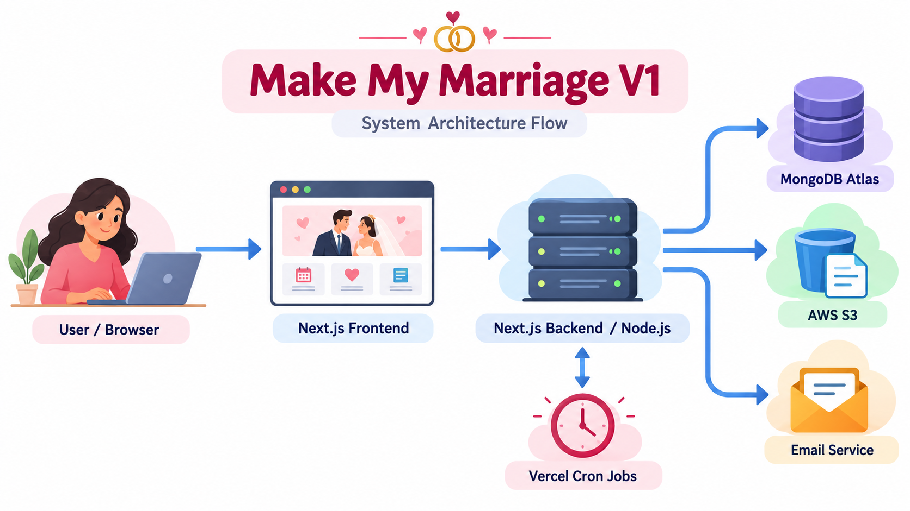

Make My Marriage

System Design & Architecture Document — V1

Full-Stack Modular Monolith using Next.js, Node.js, MongoDB Atlas, AWS S3, Vercel, and Email Notifications

| Version | 1.0 |
| --- | --- |
| Product | Make My Marriage |
| Initial Market | India |
| Primary Segment | Middle-class Indian weddings |
| Business Model | One-time payment per wedding |
| Platform | Responsive web application |
| Document Status | V1 System Design & Architecture |

Figure 1. High-level architecture flow for Make My Marriage V1

# 1. Document Purpose

This document defines the finalized system design and architecture for Make My Marriage V1. It captures the agreed product-architecture decisions, high-level request flow, component responsibilities, data design, security and validation approach, deployment model, and the implementation plan for V1.

# 2. Product Context

Make My Marriage is a web application for Indian wedding planning and collaboration. It allows the bride, groom, and their family members to organize wedding events, tasks, guests, RSVP responses, expenses, photos, activities, and a public wedding website from one shared workspace.

# 3. Finalized Architecture Decisions

- Architecture style: Full-stack modular monolith

- Frontend framework: Next.js

- Backend runtime: Node.js through Next.js APIs/server capabilities

- Hosting platform: Vercel

- Database: MongoDB Atlas

- Image storage: AWS S3

- Authentication: Email and password for bride/groom/family members

- Guest access: No guest login; guests use a public wedding website URL

- URL pattern for wedding website: makemymarriage.in/wedding/{slug}

- Notifications for V1: Email notifications only

- Background scheduling: Vercel Cron Jobs

- Rate limiting: Basic durable rate limiting for sensitive/public APIs

- Delete strategy: Hard delete

- One user belongs to one wedding in V1

- No separate Express/NestJS backend and no microservices in V1

# 4. Technology Stack

| Layer | Technology | Purpose |
| --- | --- | --- |
| Frontend | Next.js + React | UI for dashboard, wedding management, and public wedding website |
| Backend | Next.js server / Node.js | APIs, business logic, validation, authentication, authorization |
| Database | MongoDB Atlas | Application data storage |
| File Storage | AWS S3 | Wedding photos and image assets |
| Hosting | Vercel | Application deployment |
| Scheduler | Vercel Cron Jobs | Task and event reminder processing |
| Email | Transactional email provider | Invitations and reminders |

# 5. High-Level Architecture Flow

The high-level request/response flow in V1 is as follows:

1. User or guest opens the application in the browser.

2. Request reaches the Next.js application deployed on Vercel.

3. Next.js renders the frontend and, when needed, calls server-side API/business logic running on Node.js.

4. The backend validates input, checks authentication and authorization, and executes business rules.

5. For data operations, the backend reads or writes data in MongoDB Atlas.

6. For image operations, the backend generates AWS S3 presigned URLs and stores image metadata in MongoDB.

7. For notification operations, the backend triggers the email service.

8. For scheduled operations, Vercel Cron runs periodic reminder jobs and invokes backend logic.

9. The response is returned to the client and the UI updates accordingly.

# 6. Access Model

## 6.1 Private Wedding Management Application

Used by authenticated wedding members. Example pages include Dashboard, Events, Tasks, Guests, Budget, Expenses, Gallery, Family, Activities, and Settings.

## 6.2 Public Wedding Website

Accessible without login. Example URL: makemymarriage.in/wedding/sai-priya. Anyone with the URL can view wedding details, public events, gallery, RSVP, and livestream content, but cannot access the private workspace.

# 7. User Roles and Permissions

## OWNER

- Creates the wedding workspace

- Full control over wedding settings and data

- Manages family members and admins

- Can create, edit, and delete events, tasks, guests, expenses, photos, and activities

- Can manage the wedding website and livestream

- Can delete the wedding workspace

## ADMIN

- Usually the other member of the couple

- Can manage events, tasks, guests, expenses, gallery, family members, website, and activities

- Nearly full management access, except ownership-level actions

## FAMILY_MEMBER

- Can view the dashboard, events, guests, budget, expenses, and activities

- Can work on assigned tasks and update task status

- Can upload photos

- Can manually add activities

- Cannot delete the wedding or change ownership

## GUEST

- Not an authenticated app role in V1

- Can access the public wedding website only

- Can view public wedding information, submit RSVP, and upload photos

# 8. V1 Functional Modules

- Authentication and account management

- Wedding workspace creation and settings

- Dashboard

- Events management

- Tasks management

- Guests and RSVP

- Budget and expenses

- Activities feed (manual and system-driven)

- Public wedding website

- Gallery and photo uploads

- Livestream links

- Email notifications and scheduled reminders

# 9. Database Design (MongoDB Atlas)

V1 uses one MongoDB database with eight core collections.

- users

- weddings

- events

- tasks

- guests

- expenses

- photos

- activities

## 9.1 Collection Summary

| Collection | Stores | Important Fields |
| --- | --- | --- |
| users | Authenticated wedding members | name, email, passwordHash, role, weddingId |
| weddings | Wedding workspace root entity | brideName, groomName, weddingDate, location, websiteSlug, budget |
| events | Wedding ceremonies and functions | weddingId, name, description, date, venue, livestreamUrl |
| tasks | Planning and coordination tasks | weddingId, eventId, title, assignedTo, priority, status, dueDate |
| guests | Guest and RSVP records | weddingId, name, phone, familyName, numberInvited, numberAttending, rsvpStatus |
| expenses | Budget and spending entries | weddingId, eventId, category, amount, paidAmount, paymentStatus |
| photos | Metadata of uploaded images | weddingId, eventId, uploadedByName, s3Key, fileName, fileSize |
| activities | Manual updates and system activity feed | weddingId, title, description, createdBy, relatedEventId, sourceType |

# 10. File and Image Storage (AWS S3)

V1 uses AWS S3 only for image storage. Receipts and document management are not included in V1.

- Wedding cover images

- Profile images

- Event or gallery images

- Guest-uploaded wedding photos

Suggested logical structure: weddings/{weddingId}/gallery/, weddings/{weddingId}/event-images/, weddings/{weddingId}/wedding-cover/, weddings/{weddingId}/profile-images/.

## 10.1 Upload Flow

1. User selects one or more images in the browser.

2. Browser requests an upload URL from the backend.

3. Backend validates permissions and generates an S3 presigned URL.

4. Browser uploads directly to S3.

5. Backend stores metadata in the photos collection.

6. Gallery is refreshed and the uploaded image becomes visible.

# 11. Key Application Flows

## 11.1 Authenticated User Flow

1. User signs up or logs in using email and password.

2. Session is created.

3. User accesses private routes such as Dashboard or Tasks.

4. Backend checks the user’s role and weddingId before allowing operations.

## 11.2 Public Wedding Website Flow

1. Visitor opens /wedding/{slug}.

2. Backend looks up the wedding by slug.

3. Wedding details, public events, gallery, RSVP, and livestream information are rendered.

## 11.3 RSVP Flow

1. Guest opens the wedding website and goes to the RSVP section.

2. Guest enters their name.

3. System finds the guest record and allows RSVP submission.

4. Guest submits Attending or Not Attending and, if attending, the number attending.

5. The guests collection is updated.

## 11.4 Task Flow

1. OWNER or ADMIN creates a task.

2. Task is assigned to a family member if needed.

3. Family member updates task status to TODO, IN_PROGRESS, or COMPLETED.

4. Related activity can appear in the activities feed.

## 11.5 Activity Flow

1. OWNER, ADMIN, or FAMILY_MEMBER manually creates an activity update.

2. Activity is saved in the activities collection.

3. Dashboard and activity feed display the update.

## 11.6 Expense Flow

1. OWNER or ADMIN creates an expense entry.

2. Expense data is stored in the expenses collection.

3. Budget summary and expense totals are updated for workspace members.

## 11.7 Reminder Flow

1. Vercel Cron runs on schedule.

2. Backend checks for pending reminders such as due tasks or upcoming events.

3. Emails are sent through the email provider.

4. Reminder state is marked appropriately to avoid duplicate sends.

# 12. Validation, Security, and Rate Limiting

## 12.1 Validation

- Frontend validation improves user experience.

- Backend validation is mandatory for correctness and security.

- Examples: required names, valid RSVP status, valid positive expense amount, allowed file types, and file size checks.

## 12.2 Authentication and Authorization

- Only authenticated users can access the private workspace.

- Each protected request verifies the current user, role, and associated weddingId.

- Guests cannot access private routes such as tasks, expenses management, or internal settings.

## 12.3 Rate Limiting

V1 includes basic rate limiting for sensitive or abuse-prone endpoints such as:

- Login

- Signup

- Forgot password

- RSVP submission

- Photo upload / presigned URL generation

- Email-triggering APIs

## 12.4 Delete Strategy

V1 uses hard deletes. Deleted data is removed permanently from the database. For photos, the application deletes both the MongoDB metadata record and the corresponding S3 object.

# 13. Deployment and Infrastructure

- Application deployed on Vercel

- MongoDB Atlas stores all application data

- AWS S3 stores images

- Transactional email provider handles outgoing emails

- Vercel Cron executes scheduled reminder jobs

# 14. Logging and Error Handling

Advanced observability is not part of V1, but the system will still rely on basic operational visibility through Vercel logs, MongoDB Atlas metrics/logs, and straightforward application error handling. User-facing errors should be clear and non-technical.

# 15. Explicitly Out of Scope for V1

- Microservices

- Separate Node/Express backend

- Redis or BullMQ

- Kafka or advanced worker infrastructure

- Google login or phone OTP

- Guest accounts

- Wedding website password protection

- Invitation tokens

- Multiple weddings per user

- Document or receipt storage

- Payment gateway

- WhatsApp/SMS/push notifications

- Image compression or thumbnail pipeline

- AI assistant

- Vendor marketplace

- Accommodation or transport management

- Advanced monitoring and soft deletes

# 16. Recommended V1 Implementation Sequence

1. Project setup and environment configuration

2. MongoDB integration

3. Authentication

4. Wedding creation and settings

5. Roles and authorization

6. Family member management

7. Events

8. Tasks

9. Activities

10. Dashboard

11. Budget and expenses

12. Guests and RSVP

13. Public wedding website

14. S3 gallery and photo uploads

15. Livestream links

16. Email notifications

17. Vercel Cron reminders

18. Rate limiting, validation, and security hardening

19. Testing and deployment

# 17. Final Summary

Make My Marriage V1 will be implemented as a clean, scalable, and practical modular monolith. The selected stack—Next.js on Vercel, MongoDB Atlas, AWS S3, and a lightweight email/scheduler setup—keeps the system simple enough for rapid delivery while still establishing a strong foundation for future versions.

This architecture supports the full V1 product scope: private wedding management for the couple and their family, a public wedding website for guests, guest RSVP, gallery uploads, expense tracking, activities, and scheduled email reminders.
